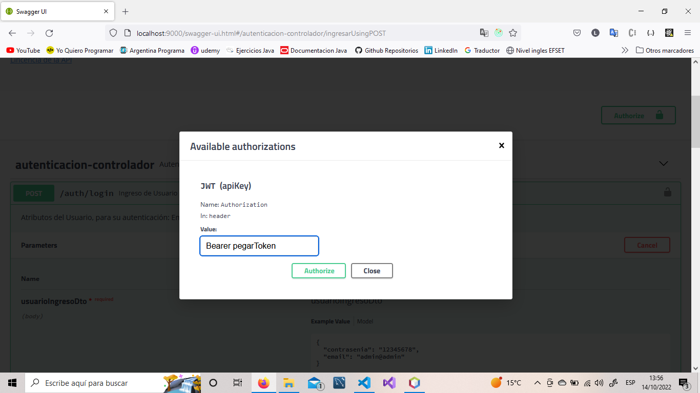
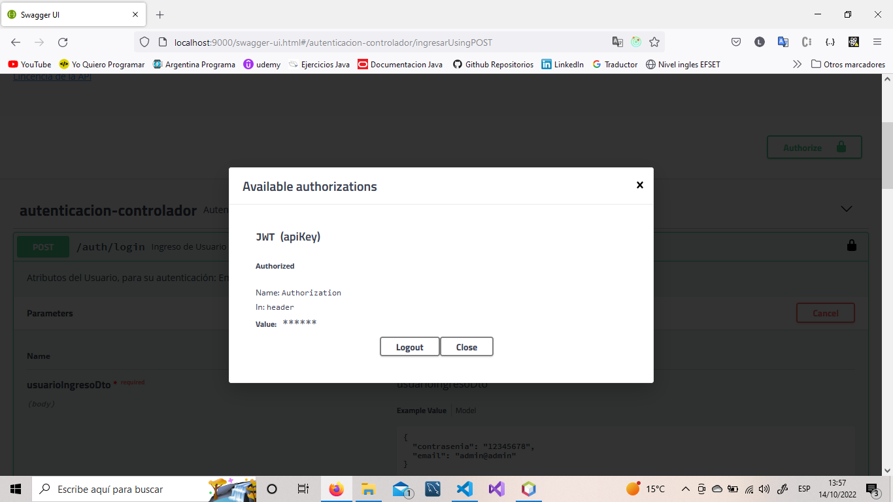
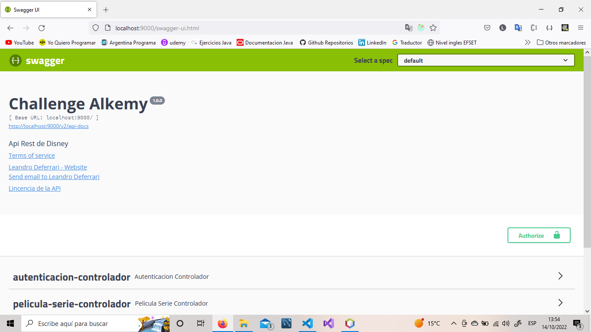
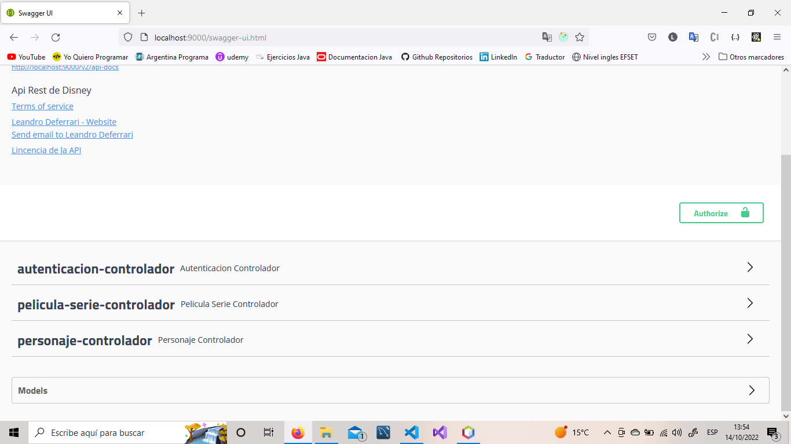
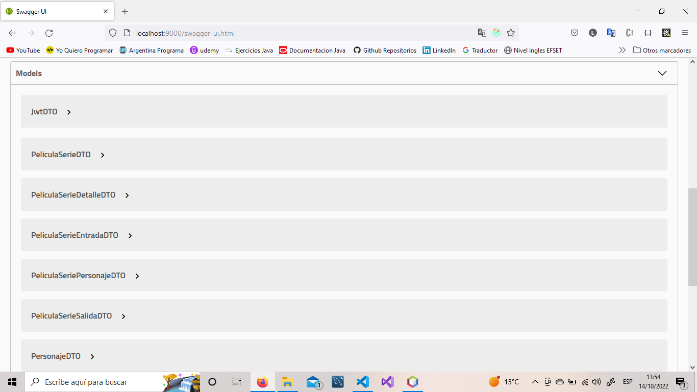
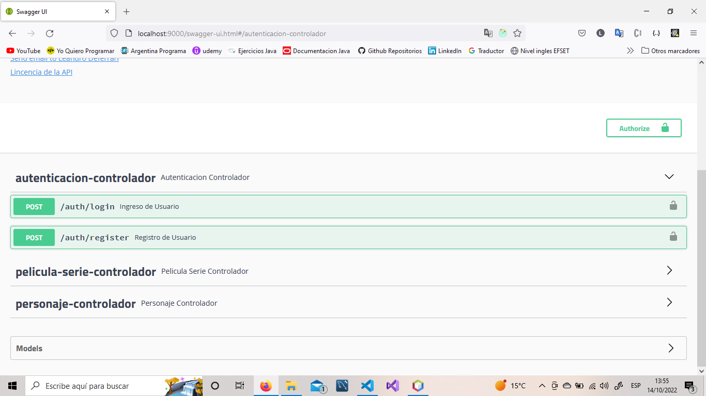
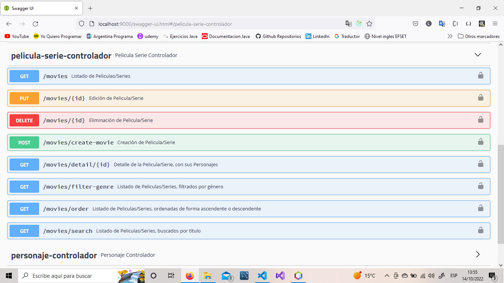
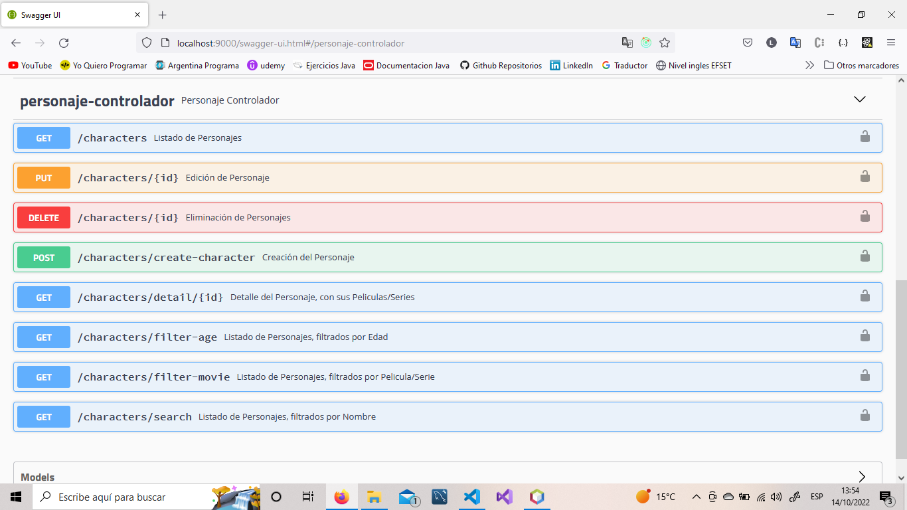

# **Challenge de Java BackEnd**
____

## **Aclaraciones**

 * Puntos que me faltaron realizar:
    * Test
    * SendGrid. Ya tenía toda la configuración y las clases, pero ahora te tienen que verificar la cuenta (al registrarte), y aún no pudieron hacerlo.
 * En el script, ubicado en la carpeta de Base De Datos, tiene incluido insertaciones de registros (de cada tabla, menos usuarios).
___

## **Token**

Para autenticarse, se debe escribir Bearer + espacio + pegar el Token (que se genera, al logearse).

___

## **Capturas de pantalla**

Vista Swagger

Vista Models

Endpoints de Autenticación

Endpoints de PeliculaSerie

Endpoints de Personaje

___
